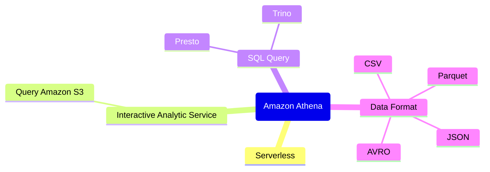

## [Amazon Athena](https://aws.amazon.com/athena/) 

### Keywords: 
* Serviceless
* Interactive query services
* SQL Query

### Tech Stack: 
* [Trino](https://trino.io/):Trino is a tool designed to efficiently query vast amounts of data using distributed queries. It was designed to handle data warehousing and analytics: data analysis, aggregating large amounts of data and producing reports.

* [Presto](https://prestodb.io/): Presto is an open source SQL query engine that’s fast, reliable, and efficient at scale. It can be used to run interactive/ad hoc queries at sub-second performance for high volume apps.

## 4W1H

### What? 
* Athena is a serverless, interactive analytics service built on open-source frameworks
* Athena use standard SQL to Amazon Simple Storeage Service (S3)
* Athena can run interactive analytics using ANSI SQL or Python
* Athena is built on open-source [Trino](https://trino.io/) and [Presto](https://prestodb.io/) engines and Apache Spark Framework 
* Athena use Presto to support various data format e.g. CSV,JSON, Apache ORC, Apache Avro and Parquet
* Athena also supports compressed data in Snappy, Zlib, LZO, and GZIP formats.
* Athena support data partition.
* Athena support pre-defined SerDe(Serializer/Deserializer) but cannot add own SerDe.
* Athena can use Apache Spark for big data workload.
* Athena can query encrypted data by using server-side encryption (SSE) with S3-managed encryption keys, SSE with AWS Key Management Service (KMS)–managed keys, and client-side encryption (CSE) with keys managed by AWS KMS
* Athena support user-defined function (UDF).
* Athena support multiple cloud analytics (e.g. Azure, Google BigQuery)

Source from: [AWS Athena](https://aws.amazon.com/athena/) and [FAQ](https://aws.amazon.com/athena/faqs/?nc=sn&loc=6)

### Why?

* Serverless provides capacity auto scaling without configuration.
* Fedearated Query can run SQL query across data stored in relational, non-relation, object and custom data source

### When? 

* Run query on S3 bucket, on-premises and other clouds
* Prepare data for complex applications (e.g. ML model and distrubuted big data engines ) by using Athena SQL query to ingest, clean and transform datasets. [more details](https://aws.amazon.com/blogs/big-data/prepare-data-for-model-training-and-invoke-machine-learning-models-with-amazon-athena/) 

### Where? 

* Athena is a regional service but it can access other regions and AWS accounts.
* Athena for SQL uses AWS Glue Data Catalog to store information and schemas about the databases and tables for data stored in S3

### Who? 

* Athena supports fine-grained access control with AWS Lake Formation. 
* Athena support control access to your data by using AWS Identity and Access Management (IAM) policies, access control lists (ACLs), and S3 bucket policies.

### How much?

* Per query is pricing per query is based on the amount of data scanned, in terabytes (TB), by the query.
* Pay less for querying compressed data because queries scan less data.
* With Provisioned capacity, pay an hourly priceing for query processing compacity.
* No charge for failed queries
* Charge for cancling queries which is for amount of data scaned.
* Charge for using the AWS Glue [Data Catelog](https://aws.amazon.com/glue/pricing/) 
