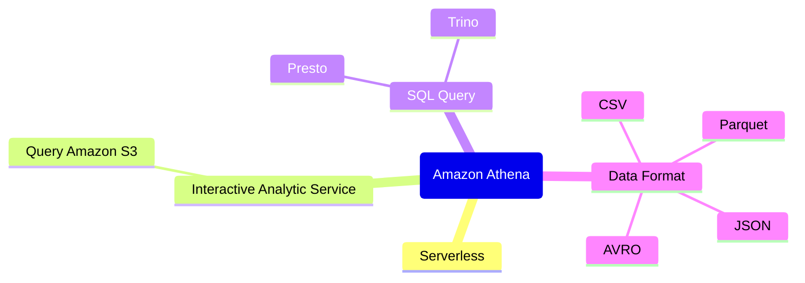
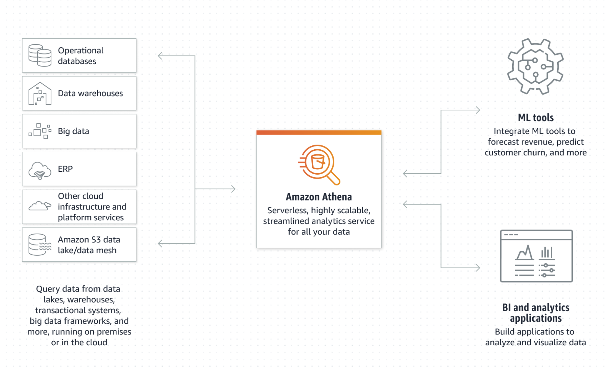

## [Amazon Athena](https://aws.amazon.com/athena/) 

### Keywords: 
* Serviceless
* Interactive query services
* SQL Query

### Tech Stack: 
* [Trino](https://trino.io/):Trino is a tool designed to efficiently query vast amounts of data using distributed queries. It was designed to handle data warehousing and analytics: data analysis, aggregating large amounts of data and producing reports.

* [Presto](https://prestodb.io/): Presto is an open source SQL query engine that’s fast, reliable, and efficient at scale. It can be used to run interactive/ad hoc queries at sub-second performance for high volume apps.

## 4W1H

### What? 
* Amazon Athena is a serverless, interactive analytics service built on open-source frameworks
* Athena is built on open-source [Trino](https://trino.io/) and [Presto](https://prestodb.io/) engines and Apache Spark Framework 
* Athena use standard SQL to Amazon S3
* Athena use Presto to support various data format e.g. CSV,JSON,ORC,AVRO and Parquet.

Source from: [https://aws.amazon.com/athena/](https://aws.amazon.com/athena/)

### Why?

### When? 

### Who? 

### How much?

### Map?